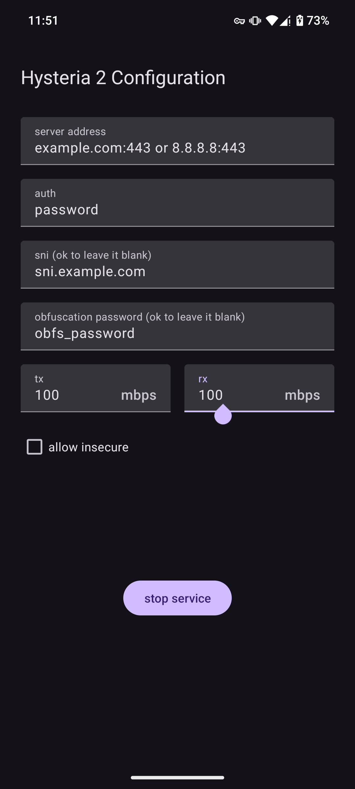

# Android-Hysteria-2-client

## 介绍

自用 android hysteria 2 客户端，基于[hysteria 2.4.0](https://github.com/apernet/hysteria/commit/f91efbeded80d5d1f43ba574e707326074fc754e)构建. 支持 64位arm架构，在 android 14上测试可用.

## 下载

- [v2.4.0](./clients/hysteria.2.4.0.apk)

## 支持功能

- 基本hysteria 2客户端，支持暴露 socks5和http端口，支持全局代理

- 自定义sni

- 支持[混淆](https://v2.hysteria.network/zh/docs/advanced/Full-Client-Config/#_4)

- 支持 insecure

- 默认开启 fastopen以降低rrt

- 针对移动设备优化电量消耗

## 截图

## 使用介绍

- server address: 服务器域名或者ip

- auth: 密码

- sni: tls 的sni部分，可以不填，默认从server address中提取. 也可以与server address不用，此时server address仅作为报文对端发送地址，实际tls握手的sni由这个字段指定

- obfuscation password: 混淆密码，如服务器未启用混淆，将其留白即可

- tx 上传速率，以mbps为单位

- rx 下载速度，以mbps为单位

- 注意：tx和rx必须按真实值填写否则会带来性能损失，若都填0则会关闭hysteria的Brutal拥堵控制协议，转用BBR，参加[官方文档](https://v2.hysteria.network/zh/docs/advanced/Full-Client-Config/#_5)

- allow insecure: 允许不安全证书，通常不应开启，否则可能导致中间人攻击

## 版权

- 感谢 [hysteria](https://github.com/apernet/hysteria) 提供协议与底层实现. [LICENSE](https://github.com/apernet/hysteria/blob/master/LICENSE.md)

- 感谢 [eycorsican/go-tun2socks](https://github.com/eycorsican/go-tun2socks) 提供代理实现. [LICENSE](https://github.com/eycorsican/go-tun2socks/blob/master/LICENSE)

## 关于

本应用仅限学习交流使用，使用请遵守当地法规。

Copyright (c) 2024 lry127 

All rights reserved

**THE SOFTWARE IS PROVIDED "AS IS", WITHOUT WARRANTY OF ANY KIND, EXPRESS OR
IMPLIED, INCLUDING BUT NOT LIMITED TO THE WARRANTIES OF MERCHANTABILITY,
FITNESS FOR A PARTICULAR PURPOSE AND NONINFRINGEMENT. IN NO EVENT SHALL THE
AUTHORS OR COPYRIGHT HOLDERS BE LIABLE FOR ANY CLAIM, DAMAGES OR OTHER
LIABILITY, WHETHER IN AN ACTION OF CONTRACT, TORT OR OTHERWISE, ARISING FROM,
OUT OF OR IN CONNECTION WITH THE SOFTWARE OR THE USE OR OTHER DEALINGS IN THE
SOFTWARE.**
